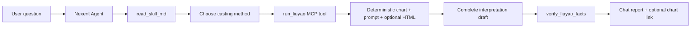

# Nexent Fortune Liuyao Agent

> **Demo design:** this repository provides a reproducible Nexent Progressive Skill package,
> deterministic MCP adapter, Agent configuration, tests, and integration documentation. It does
> not claim that a Nexent instance/E2E run or official Agent export has been completed.

Fortune Liuyao is designed for Nexent v2.4.0. It routes a user's question by meaning, supports
automatic casting, staged line casting, or six manually supplied coin/line results, then delegates
Wenwang Najia chart calculation to the bundled
[`fortune-liuyao`](skill/fortune-liuyao/README.md) Skill. The Nexent Agent writes the complete
interpretation in chat and sends its draft through a deterministic fact audit before answering.

## Why this design

The project keeps the workflow native to Nexent instead of building a second chat UI:

1. Nexent owns conversation, model access, tool traces, and Markdown output.
2. The Progressive Skill owns semantic routing, casting discipline, interpretation method, and safety.
3. The MCP adapter runs the Skill's deterministic engine and publishes an optional HTML chart.
4. The current Agent interprets the returned prompt; no second model or user API key is required.
5. The fact audit catches explicit chart contradictions without mechanically grading divination.



## [`$fortune-liuyao`](skill/fortune-liuyao/SKILL.md) Chart Preview
The image below is the standalone chart preview bundled with the upstream Skill. It demonstrates
the chart presentation target and is not presented as evidence of a live Nexent instance run.


Fortune Liuyao standalone chart preview
安装并启用 Agent 后，直接在下一条消息里用自然语言触发，不需要手动运行排盘脚本。例如：

```text
用六爻看一下：未来三个月我能不能找到合适工作？
```

也可以显式点名 Skill：

```text
$fortune-liuyao 帮我占一下今年求职是否顺利
```

Agent 会按 [`SKILL.md`](skill/fortune-liuyao/SKILL.md) 的流程处理：理解问题并选择领域，
让用户选择起卦方式，调用确定性引擎排盘，最后在当前对话中给出完整解读，并可附带 HTML
卦盘。对话里可选择三类起卦方式：

1. **自动起卦**

   只说问题即可，例如：`未来三个月感情会不会有进展？`

2. **逐爻生成**

   从初爻开始依次生成六爻；每一爻只生成一次，第六次完成后直接排盘。

3. **输入硬币或爻值**

   六个爻值按初爻到上爻输入：

   ```text
   7, 8, 6, 7, 9, 8
   ```

   六次硬币结果同样按初爻到上爻输入：

   ```text
   正反反 / 正正反 / 反反反 / 正反反 / 正正正 / 正正反
   ```

硬币约定为正面记 3、反面记 2；6、9 是变爻。第一次对应最下面的初爻，第六次对应最上面
的上爻。

高风险问题不会进入排盘，包括医疗诊断、生死、胎儿性别、母婴安危、失踪定位，以及需要
专业意见的重大法律或财务决策。这类问题会转向现实帮助。

## Repository layout

```text
skill/fortune-liuyao/       bundled Fortune Liuyao Progressive Skill
tools/fortune_runtime.py    isolated deterministic adapter and run store
tools/mcp_server.py         FastMCP adapter for Nexent
nexent/agent-config.md      Agent fields, prompts, and dependency contract
docs/NEXENT_SETUP.md        proposed integration steps
docs/MANUAL_DEMO_RUNBOOK.md acceptance-oriented, currently unexecuted runbook
docs/TEST_PLAN.md           local gates and deferred Nexent instance gates
artifacts/validation/       observed local verification record
```

## Build the Skill and run local checks

```bash
python -m unittest discover -s tests -v
python skill/fortune-liuyao/scripts/run_liuyao.py --selfcheck
python scripts/package_skill.py
python scripts/package_skill.py --validate-only
```

Optional Demo MCP service:

```bash
python -m pip install .
fortune-liuyao-mcp
```

For a Docker-based Nexent deployment, register `http://host.docker.internal:8000/sse`. See the
[setup guide](docs/NEXENT_SETUP.md) and [Agent configuration](nexent/agent-config.md).

## Required tool chain

```text
read_skill_md("fortune-liuyao")
→ check_liuyao_runtime (first run in a deployment)
→ run_liuyao (or six one-time cast_liuyao_line calls, then run_liuyao)
→ complete interpretation draft from returned prompt
→ verify_liuyao_facts
→ complete chat interpretation + optional HTML chart
```

## Current verification status

- Progressive Skill archive: locally validated and reproducibly packaged.
- MCP adapter, runtime self-check, and packaging contract: local checks passed.
- Nexent instance/E2E conversation: **not executed**.
- Live MCP registration and user-side HTML download: **not executed**.
- Official Nexent Agent export: **not created**.

See the [validation report](artifacts/validation/validation-report.md).

## Safety and responsible use

- Medical diagnosis, life/death, pregnancy and fetal sex, missing-person location, and similarly
  high-risk questions are redirected before chart generation.
- Divination output is cultural interpretation, not professional medical, legal, financial, or
  major-life-decision advice.
- Production deployment needs authenticated storage, tenant isolation, expiry, deletion,
  observability, rate limits, and privacy review beyond this Demo.
- The complete interpretation must remain in chat. An HTML chart is optional and never a substitute.

## License

This integration and the bundled Fortune Liuyao Skill are distributed under Apache License 2.0.
The vendored `lunar_python` license and upstream attributions are preserved in
[THIRD_PARTY_NOTICES.md](THIRD_PARTY_NOTICES.md).
